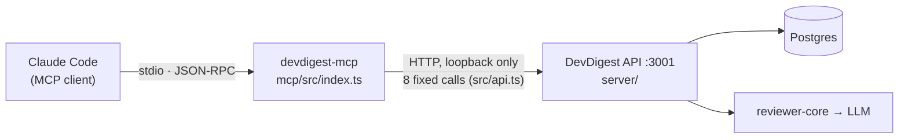

# `devdigest-mcp` — DevDigest as MCP tools

A local **stdio** [MCP](https://modelcontextprotocol.io) server that lets an MCP
client (Claude Code, MCP Inspector, …) use DevDigest: pick a reviewer, run it on
a PR, read the grounded findings and the repo's conventions.

It is a **thin client over the local DevDigest API** (`http://127.0.0.1:3001`).
It has no database connection, no secrets and no LLM keys of its own. Everything
it does goes through a closed set of API calls, so the API's domain code (workspace
scoping, validation, rate limits, the grounding gate) limits what a tool can do.



## Tools

| Tool | Read-only | What it does | API calls |
|---|---|---|---|
| `list_agents` | yes | Reviewer agents configured in DevDigest (enabled only by default); no system prompts | `GET /agents` |
| `run_agent_on_pr` | **no** (starts a paid LLM run) | Starts a review of `repo` + `pr_number` with `agent` (name or id), **waits up to 120 s** (fixed, from the call's entry — not a tool argument; polls, progress notifications), returns `run_id` + verdict + counts per severity, or `status: "running"` if the run outlives the budget. Client cancel → the run is cancelled | `GET /agents`, `/repos`, `/repos/:id/pulls`, `POST /pulls/:id/review`, `GET /pulls/:id/runs`, `/pulls/:id/reviews`, `POST /runs/:id/cancel` |
| `get_findings` | yes | Verdict + compact findings (severity, file, lines, rationale, suggestion) of one run (`run_id`) or of the newest review of every agent; `min_severity`, `include_dismissed`, `limit` (max 100, default 20); `omitted` + a `next_step` when the limit or the 24 000-char response budget cuts the set | `GET /repos`, `/repos/:id/pulls`, `/pulls/:id/reviews`, `/pulls/:id/runs` |
| `get_conventions` | yes | Conventions extracted from the repo (L02), `accepted` by default, first verified evidence location of each; same `limit` / `omitted` / response-budget rules as `get_findings` | `GET /repos`, `/repos/:id/conventions` |
| `get_blast_radius` | yes | **Stub**: final input/output schema, always returns `not_implemented` (lands with the Blast Radius homework) | none |

`list_prs` / `list_repos` are deliberately missing: `gh` or the GitHub MCP already
do that. `list_agents` stays, because only DevDigest knows the reviewer config.

**Tool rules the code enforces:**

- Every read tool has `readOnlyHint: true, destructiveHint: false, idempotentHint: true,
  openWorldHint: false`. `run_agent_on_pr` is `readOnlyHint: false, destructiveHint: false,
  idempotentHint: false, openWorldHint: true`.
- Every `inputSchema` is a `z.object({...}).strict()`: an unknown argument is a
  validation error (`isError: true`), not silently dropped.
- Every output field that can be missing is `.optional()`, never `.nullable()` —
  a JSON Schema `"type": ["x", "null"]` is what `@modelcontextprotocol/inspector
  --strict` flags, and absent keys are one token cheaper than `null` ones.
- Every tool has an `outputSchema`. Success returns `structuredContent` plus the
  same JSON as text.
- Every failure is a tool error (`isError: true`) whose text is
  `[code] what happened` followed by `Next step: …`. Examples: `api_unreachable`
  (start the API), `repo_not_imported` (lists the imported repos),
  `pr_not_found` (lists known PR numbers), `agent_not_found` /
  `agent_ambiguous` / `agent_disabled`, `rate_limited`, `run_failed` /
  `run_cancelled` ("do not report the PR as clean"), `run_in_progress`,
  `not_implemented`. An unexpected error becomes a generic `internal_error`;
  the raw message goes to stderr only, never back to the client.
- Powers are limited in code:
  - `src/api.ts` has no generic request method, so the tools can't delete,
    accept or dismiss, change settings or import anything.
  - A disabled agent is refused.
  - `DEVDIGEST_API_URL` must be a loopback host.

## Run

The DevDigest API must be running (`./scripts/dev.sh`, or `cd server && pnpm dev`).
The MCP server starts without it and each tool call explains what to do.

```sh
cd mcp && npm install
npm start                 # stdio; stdout is the protocol, logs go to stderr
npm run inspect           # MCP Inspector UI (browser)
```

| Env | Default | |
|---|---|---|
| `DEVDIGEST_API_URL` | `http://127.0.0.1:3001` | must be loopback (127.0.0.1 / localhost / ::1) |
| `DEVDIGEST_MCP_REQUEST_TIMEOUT_MS` | `30000` | per HTTP call |
| `DEVDIGEST_MCP_POLL_INTERVAL_MS` | `2000` | run status polling in `run_agent_on_pr` |

### MCP Inspector (CLI mode)

The CLI of `@modelcontextprotocol/inspector` 2.x takes a config file (a bare
command + `-e` prints "No servers found" / "Method is required"):

```sh
npx -y @modelcontextprotocol/inspector --cli --config .mcp.json --server devdigest --method tools/list --strict
npx -y @modelcontextprotocol/inspector --cli --config .mcp.json --server devdigest \
  --method tools/call --tool-name run_agent_on_pr \
  --tool-arg repo=acme/payments-api pr_number=482 'agent=Security Reviewer'
```

(run from the repo root; `.mcp.json` points at `mcp/node_modules/.bin/tsx`)

**Real LLM runs through the CLI.** The Inspector ignores `.mcp.json`'s `timeout` and
cuts every call at 60 s. `run_agent_on_pr` then sees the client cancel and cancels the
DevDigest run (history shows it as `cancelled`, "Cancelled by user"). Use a copy of
the config with `requestTimeout` on the server entry:

```sh
python3 -c "import json; c=json.load(open('.mcp.json')); c['mcpServers']['devdigest']['requestTimeout']=180000; json.dump(c, open('/tmp/devdigest-mcp-long.json','w'))"
npx -y @modelcontextprotocol/inspector --cli --config /tmp/devdigest-mcp-long.json --server devdigest \
  --method tools/call --tool-name run_agent_on_pr \
  --tool-arg repo=podop/dev-digest pr_number=6 'agent=Security Reviewer'
```

`timeout: 180000` in `.mcp.json` is meant for Claude Code (per-server call limit, per its MCP docs; not yet verified in a live session — if a run is cut short there, set `MCP_TOOL_TIMEOUT=180000`).

For a key-free end-to-end check, run the API with `LLM_PROVIDER_OVERRIDE=mock`.
Its fixed review grounds on the seeded PR `acme/payments-api#482`.

### Claude Code

The repo root has a project-scoped `.mcp.json` (server name `devdigest`).
Start `claude` in the repo root, approve the server once, then check `/mcp`.
Outside this repo:

```sh
claude mcp add devdigest -- /abs/path/dev-digest/mcp/node_modules/.bin/tsx /abs/path/dev-digest/mcp/src/index.ts
```

Expected flow for *"Review PR #3 in podop/dev-digest with the Security Reviewer
agent and tell me if there are critical findings"*:
`list_agents` → `run_agent_on_pr` → `get_findings`. The answer quotes
DevDigest's findings (`has_critical`, `counts.CRITICAL`, the findings list).

## Layout

```
src/index.ts          stdio entry (config → API client → server → transport)
src/server.ts         McpServer + instructions, registers the tools
src/api.ts            the closed set of HTTP calls + error → ToolError mapping
src/resolve.ts        "owner/name" + PR number + agent name → DevDigest ids
src/present.ts        compact verdict / finding projections + their zod schemas
src/tools/*.ts        one file per tool
test/tools.test.ts    real McpServer over InMemoryTransport, fake API
```

`npm test` · `npm run typecheck` · `npm run lint`. CI: `.github/workflows/mcp.yml`.
