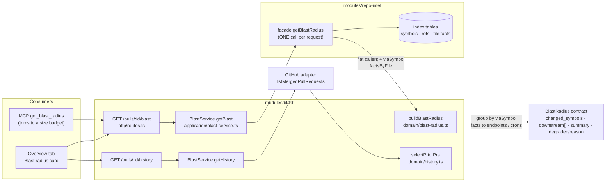

# Blast radius (`modules/blast`)

Spec: [`../specs/07-blast-radius.md`](../specs/07-blast-radius.md). Client card:
`client/specs/07-blast-radius.md`. Read-only: the module re-indexes nothing and calls no model.

## Flow

## Mapping (`domain/blast-radius.ts`)

- Facade returns flat callers, each tagged `viaSymbol`, plus `factsByFile`. Callers are grouped by `viaSymbol`; a caller sitting in the file that declares that symbol is dropped.
- A group's `endpoints_affected` / `crons_affected` = de-duplicated union of `factsByFile[file]` over its caller files.
- Groups sort by highest caller rank (desc), callers by rank; ties fall back to name/file/line (deterministic).
- `summary` is built from distinct counts, e.g. `3 changed symbols · 7 callers · 2 endpoints · 1 cron`.
- `degraded` / `reason` pass through unchanged.
- Caller cap: `MAX_CALLERS_PER_SYMBOL` (`repo-intel/constants.ts`, 20) is applied **per `viaSymbol`** in the facade (`repo-intel/application/blast-radius.ts`), before facts are read; endpoints come only from kept caller files.

## Degraded reasons

`degraded: true` means **unknown, not "no impact"**. Contract enum `BlastDegradedReason` (`vendor/shared/contracts/brief.ts`):

| reason | Meaning |
|---|---|
| `flag_off` | repo-intel disabled; ripgrep fallback |
| `index_failed` | index build failed (`status: failed`); ripgrep fallback |
| `index_partial` | index incomplete (`status: partial`); persistent data kept |
| `repo_too_large` | walk truncated at `MAX_INDEXED_FILES` (`stats.bounded > 0`, any usable status; wins over `index_partial`); persistent data kept |
| `no_data` | no `repo_index_state` row (or a degraded row without a stored reason); ripgrep fallback |

The facade (`repo-intel/application/blast-radius.ts`) sets these from the flag and `repo_index_state` (a `degraded` row passes its stored `degradedReason`); only a complete `full` index returns `degraded: false`. The card offers Resync (`POST /repos/:id/resync`).

## History (`GET /pulls/:id/history`)

`BlastService.getHistory` lists the repo's merged PRs through the GitHub adapter (`HISTORY_SCAN_LIMIT` = 30, `domain/constants.ts`), keeps those sharing files with this PR, excludes the PR itself, newest first, at most `HISTORY_MAX_ITEMS` = 10. No token, GitHub error or timeout → warning + `{ history: [] }`, never a failed request. A PR from another workspace is a 404 on both routes.

## MCP size budget (`mcp/src/tools/get-blast-radius.ts`)

The server returns everything; the MCP tool only trims. Response budget `MAX_RESPONSE_CHARS` = 24 000 (`mcp/src/present.ts`) minus a reserve for trailing fields.

Cut order (first to last):
1. `max_callers` per group (1-200, default 50), `changed_symbols` ≤ 50, endpoints/crons ≤ 10 per group (`omitted_symbols`, `omitted_endpoints`).
2. Over budget: whole lowest-ranked downstream groups dropped (`omitted_groups`; their callers counted in `omitted_callers`), always keeping at least one group.
3. Still over: callers popped from the largest remaining group (`trimToBudget`).

`summary` keeps true totals; `next_step` states what was cut or, when degraded, says to Resync in the UI.
