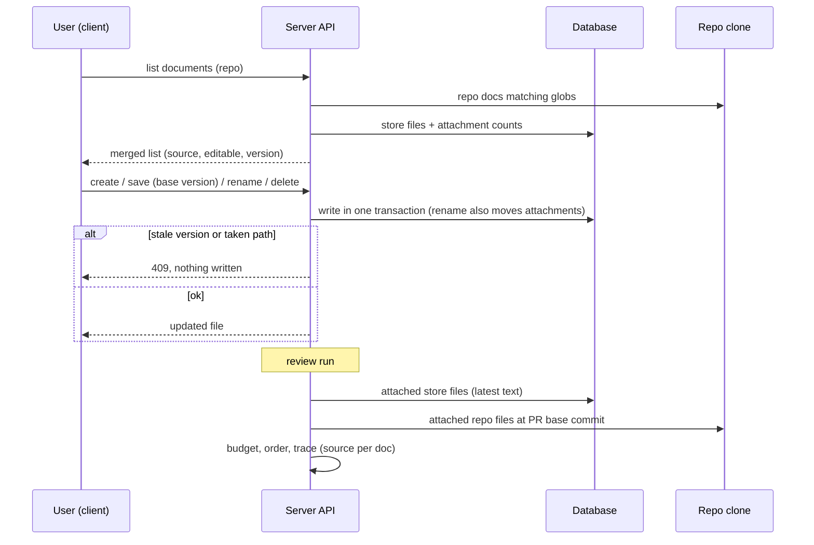

# Project Context — file management
Spec: 2026-10-01-project-context-files · Modules: server, client · Status: ready-for-planning
Design sources: user request (2026-10-01, chat) "file management in project context: edit file as shown"; screenshot read: [16] Project Context — left pane header "PROJECT CONTEXT · .devdigest/specs/", toolbar icons new file (+), new folder, upload, refresh; file list incl. `untitled.md`, `new-folder/spec.md`, `uploaded-spec.md`, `new-folder/spec-2.md`, `uploaded-spec-2.md`; right pane `public-api.md` with a Preview | Edit toggle, Edit showing the raw markdown in a monospace editor. Earlier frame [3] (same screen, Preview).
Related: `specs/2026-10-01-project-context.md` — this spec supersedes its D1 (view-only), its Out-of-scope line "No editing, creating, uploading, renaming or deleting documents from DevDigest", and its design-review item 1; everything else there stays in force.

## 1. Goal
Teams want to write the specs their reviewers should follow without committing them to the
repository first. Project Context gets an editable `.devdigest/specs/` folder per repo, owned
by DevDigest: the user creates, edits, uploads, renames and deletes markdown files there,
attaches them to agents and skills like any other document, and every review uses the latest
saved text. Documents that come from the repository itself stay read-only.

## 2. Context
- Project Context lists the clone's markdown files matching the configured globs, previews them, stores per-repo ordered attachments of paths to agents and skills, and at run time reads attached documents from the PR's base commit with a 256 KB per-file and 16 000-token per-run budget, recording skipped ones (`specs/2026-10-01-project-context.md` FR1–FR8; `server/src/modules/project-context/application/project-context-service.ts:188-229`).
- The listed document shape is `ContextDoc {path, name, doc_type, size_bytes, tokens, updated_at, used_by}` (`server/src/vendor/shared/contracts/project-context.ts:31-42`); documents are not stored anywhere today — they are derived from the clone.
- The clone is a shallow, DevDigest-managed checkout (`server/src/modules/repos/service.ts:57-58`); writing there would not reach the remote and is lost on re-clone (decision D1 of the related spec).
- Existing building blocks: optimistic concurrency with `base_version` → 409 on a stale save (skills, `vendor/shared/contracts/knowledge.ts:156-163`, `modules/skills/application/skills-service.ts:109-111`); a CodeMirror markdown editor and an unsaved-changes guard (`client/src/app/skills/[id]/_components/SkillEditor/_components/BodyEditor/CodeMirrorField.tsx`, `.../SkillEditor/useUnsavedChangesGuard.ts:18`); markdown preview without raw HTML (`client/INSIGHTS.md:49`).

## 3. Scope
### In scope
- A per-repo, DevDigest-owned set of markdown files shown as the `.devdigest/specs/` folder of the Project Context screen.
- Create (new file, new folder, upload), edit with Preview | Edit, save, rename, delete, refresh.
- Using these files everywhere repo documents are used: list, preview, attach to agents/skills, token totals, review runs, trace.
### Out of scope
- No write to the repository clone, no git commit, branch or push.
- Repository documents (from the clone) cannot be edited, renamed or deleted; their Edit toggle is disabled.
- No version history, diff or restore for these files; a save replaces the text.
- No collaborative real-time editing; concurrent saves are detected, not merged.
- No non-markdown files (images, PDFs, other extensions).
- No change to how repository documents are read at run time (PR base commit).
- No MCP tool changes.

## 4. User scenarios
- US1 — As a user, I create a spec file in `.devdigest/specs/`, write it in the editor and save it, so that I can attach it to an agent without committing it to the repo.
- US2 — As a user, I upload existing `.md` files from my computer into `.devdigest/specs/`.
- US3 — As a user, I organise the files: put them in folders, rename and delete them.
- US4 — As a user, after I edit an attached file, the next review uses the new text and the trace shows it.

## 5. Functional requirements
- FR1 [server] — The system shall store, per repo, a set of DevDigest-owned markdown files, each with a path under `.devdigest/specs/`, text content, size, a version number starting at 1 and incremented on every content save or rename, and an update time. (US1)
- FR2 [server] — The document list of a repo shall include these files together with the repository documents; each listed document carries `source: 'store' | 'repo'` and `editable` (true only for `store`); store files have `doc_type: 'specs'`; token estimates and `used_by` work as for repository documents. (US1)
- FR3 [server] — The system shall create a store file from a path and content; with no path it creates `.devdigest/specs/untitled.md`; when the path is taken and the request asks for it, a numeric suffix is added before `.md` (`untitled-2.md`, `uploaded-spec-2.md`, …); otherwise a taken path is rejected. (US1, US2)
- FR4 [server] — The system shall save new content of a store file only when the request's base version equals the stored version; otherwise it rejects the save as stale and changes nothing. (US1)
- FR5 [server] — The system shall rename (move) a store file to a new path under `.devdigest/specs/`, with the same base-version rule; every attachment of the old path in this repo (agents and skills) then points to the new path, keeping its position. (US3)
- FR6 [server] — The system shall delete a store file; attachments to it are kept and the document becomes `missing` for runs and in the attachment lists, as for any absent document. (US3)
- FR7 [server] — At run time a store file is read from the store (latest saved text), not from the PR base commit; per-file and per-run limits, ordering, de-duplication and trace records stay as in the related spec; the trace record carries `source: 'store'`. (US4)
- FR8 [server] — A path in the store shall: start with `.devdigest/specs/`, end in `.md`, have at most 5 folder levels below `.devdigest/specs/`, use only letters, digits, `.`, `_`, `-` in each segment, contain no empty, `.` or `..` segment, and be ≤ 512 characters; a repo has at most 500 store files; a file is at most 256 KB of UTF-8 text. (US1, US2, US3)
- FR9 [server] — When the repository clone already contains a file at a path under `.devdigest/specs/`, a store file cannot be created or renamed onto that path; the repository file stays listed read-only. (US1)
- FR10 [client] — The Project Context left pane shall show the header "PROJECT CONTEXT" with the `.devdigest/specs/` folder, a toolbar with New file, New folder, Upload and Refresh buttons, and the store files (folder paths shown as `folder/file.md`) above the read-only repository documents. (US1, US3)
- FR11 [client] — New file shall create `untitled.md` (suffixed when taken), select it and open it in Edit mode with the name ready to rename; New folder shall ask for a folder name and create `<folder>/untitled.md` in it, opened in Edit mode (folders exist only through their files). (US1, US3)
- FR12 [client] — Upload shall open a file picker for one or more `.md` files, read them as text in the browser and create each in `.devdigest/specs/` keeping its file name, suffixed when taken; a non-`.md`, non-UTF-8 or > 256 KB file is skipped with a toast naming it. (US2)
- FR13 [client] — For a store file the right pane shall show the file name, a Preview | Edit toggle, and in Edit a monospace markdown editor with Save (also Ctrl/Cmd+S) and an unsaved-changes indicator; leaving the file, switching repo or closing the page with unsaved changes asks for confirmation. For a repository document Edit is disabled with the hint "Repository files are read-only — create a copy in .devdigest/specs/ to edit". (US1)
- FR14 [client] — A stale save shall show "This file changed since you opened it" with Reload (discard my edits) and Keep editing; nothing is overwritten. (US1)
- FR15 [client] — Each store file shall offer Rename and Delete (row menu); Delete asks for confirmation and shows "Used by N agents" when N > 0; Rename validates the path inline before sending. (US3)
- FR16 [client] — After any create, save, rename or delete, the list, the preview, the token totals and every open Context tab of agents and skills for this repo shall show the new state without a manual refresh. (US4)

## 6. Workflow and communication

- Client → server: sync HTTP. On any error the editor keeps the user's text; nothing is lost client-side.
- Server → database: each operation is one transaction; a rename that fails leaves both the file and its attachments unchanged.
- Server → clone: read-only (listing and the FR9 collision check). Clone absent → only store files are listed; FR9 check is skipped.

## 7. Contracts
`ContextDoc` (list item) gains `source: 'repo' | 'store'`, `editable: boolean`, `version?: number` (store only). The single-document response gains the same fields. Existing consumers ignore unknown fields; both `@devdigest/shared` copies change.

**POST /repos/:id/context/files** body `{ path?: string, content?: string, on_conflict?: 'fail' | 'suffix' }` (default `fail`; no `path` → `.devdigest/specs/untitled.md` with `suffix`) → 201 single-document response. Errors: 404 `repo_not_found`; 409 `path_exists` (taken in store or in the clone, `on_conflict: 'fail'`); 413 `doc_too_large`; 422 `invalid_path`; 422 `too_many_files`.

**PUT /repos/:id/context/files?path=<path>** body `{ content: string, base_version: number }` → 200 single-document response with the new version. Errors: 404 `repo_not_found` / `doc_not_found`; 403 `read_only` (a repository document); 409 `stale_version` (details `{current_version}`); 413 `doc_too_large`.

**POST /repos/:id/context/files/rename** body `{ path: string, new_path: string, base_version: number }` → 200 single-document response at the new path. Errors: 404; 403 `read_only`; 409 `path_exists`; 409 `stale_version`; 422 `invalid_path`.

**DELETE /repos/:id/context/files?path=<path>** → 204. Errors: 404 `repo_not_found` / `doc_not_found`; 403 `read_only`.

Run trace `project_context.docs[]` items gain `source: 'repo' | 'store'` (optional; absent on older traces = `repo`).

## 8. Data model (logical)
- **Store file** — repo × path (unique), content, size, version, updated time. Deleted with its repo. Not part of agent or skill versions.
- Attachments (related spec) keep referencing paths; a rename rewrites the path of the matching attachments of this repo; a delete leaves them.
- Folders are not stored; they are path prefixes of store files.

## 9. States and UX
| Screen / element | Loading | Empty | Error | Degraded | Success | Notes |
|---|---|---|---|---|---|---|
| `.devdigest/specs/` folder in list | skeleton rows | "No files yet — create or upload a spec" + New file / Upload | load error + Retry | clone missing: only store files, repo section shows "not cloned" | files with names, folders as `folder/` prefixes | store files above repo docs |
| Editor (Edit) | — | empty file shows placeholder "Write markdown…" | save error toast, text kept | stale → banner with Reload / Keep editing | "Saved" for 2 s, version updated | unsaved dot on the file name |
| Preview | skeleton | "Empty file" | 404 → "File was deleted" | — | rendered markdown | raw HTML shown as text |
| Upload | per-file progress | — | toast per skipped file | — | toast "N files uploaded" | |
| Rename / Delete | button busy | — | inline error (`path_exists`, `invalid_path`) | — | list updates | Delete confirmation names used-by agents |

## 10. Edge cases
- EC1 [server] — Two tabs edit the same file; the second save carries an old base version → 409 `stale_version`, first save kept (FR4).
- EC2 [server] — Create or rename onto a path that exists in the clone → 409 `path_exists` (FR9).
- EC3 [server] — Path with `..`, a leading `/`, a backslash, a segment with spaces or unicode, more than 5 folder levels, or not ending in `.md` → 422 `invalid_path`, nothing written (FR8).
- EC4 [server] — Rename of an attached file → attachments of this repo follow, order unchanged; attachments in other repos (same path string) are untouched (FR5).
- EC5 [server] — Delete of an attached file → next run records it `missing`, the run completes (FR6).
- EC6 [server] — The 501st file in a repo → 422 `too_many_files` (FR8).
- EC7 [client] — Upload of `notes.txt`, a 300 KB `.md`, or a binary renamed to `.md` → skipped with a toast naming the file; the others are uploaded (FR12).
- EC8 [client] — Switching file, repo or route with unsaved edits → confirmation; Cancel keeps the editor (FR13).
- EC9 [client] — The file open in the editor is deleted or renamed in another tab → the next save returns 404/409 and the editor offers Reload (FR14).
- EC10 [server] — An attached store file edited between two runs of the same PR → each run's trace holds the text it actually sent (FR7).

## 11. Non-functional requirements
- NFR1 [server] — Store content is untrusted at prompt time exactly like repository documents (wrapped, path-labelled, existing injection guard); it is rendered in the UI only as escaped markdown/plain text.
- NFR2 [server] — Every write validates path and size before touching storage; no write reaches the file system or the clone.
- NFR3 [server] — Create, save, rename and delete each respond in ≤ 300 ms for a 256 KB file on a local database; each logs one line (repo id, operation, path, size, version) without content.
- NFR4 [client] — All new strings in `messages/en`; toolbar buttons have accessible labels; the editor is keyboard-operable and Ctrl/Cmd+S saves without triggering the browser's save dialog.

## 12. Dependencies and rollout
- Shared contract change: yes — `ContextDoc` and the single-document response gain `source`, `editable`, `version`; trace doc gains optional `source`; both copies.
- Persisted data change: yes — new store-file entity (migration).
- No feature flag; server and client ship together. Existing attachments keep working unchanged.

## 13. Acceptance criteria
- AC1 [server] — Given a repo, when POST `/repos/:id/context/files` is sent with no body twice, then two files `.devdigest/specs/untitled.md` and `.devdigest/specs/untitled-2.md` exist with version 1, and the list shows them with `source: 'store'`, `editable: true`, `doc_type: 'specs'`, tokens and `used_by: 0`. Traces: FR1, FR2, FR3 · Verify: integration
- AC2 [server] — Given an existing store file, when POST with the same path and `on_conflict: 'fail'` is sent, then 409 `path_exists`; with `on_conflict: 'suffix'` a `-2` file is created. Traces: FR3 · Verify: integration
- AC3 [server] — Given a store file at version 1, when PUT with `base_version: 1` saves new content, then 200 with version 2 and the preview returns the new content; a second PUT with `base_version: 1` returns 409 `stale_version` with `current_version: 2` and the content is unchanged. Traces: FR4, EC1 · Verify: integration
- AC4 [server] — Given a store file attached to agent A at position 2 and to skill S, when it is renamed to `.devdigest/specs/api/public.md`, then GET of A's and S's attachments shows the new path at the same position, the old path is gone, the version increased, and an attachment with the same old path in another repo is unchanged. Traces: FR5, EC4 · Verify: integration
- AC5 [server] — Given an attached store file, when it is deleted and a review runs, then the run completes and the trace records the path as `missing`; the attachment still exists. Traces: FR6, EC5 · Verify: integration
- AC6 [server] — Given an attached store file whose content was saved after the PR was opened, when a review runs, then the prompt's project-context block contains the latest saved text and the trace doc has `source: 'store'`; a repository document in the same run is still read from the base commit with `source: 'repo'`. Traces: FR7, EC10, NFR1 · Verify: integration
- AC7 [server] — Given paths `../x.md`, `/.devdigest/specs/a.md`, `.devdigest/specs/a b.md`, `.devdigest/specs/a.txt`, `.devdigest/specs/1/2/3/4/5/6/a.md`, `specs/a.md`, when used to create or rename, then each returns 422 `invalid_path` and nothing is stored; a 300 KB content returns 413 `doc_too_large`; the 501st file returns 422 `too_many_files`. Traces: FR8, EC3, EC6, NFR2 · Verify: integration
- AC8 [server] — Given a clone that contains `.devdigest/specs/existing.md`, when a store file is created or renamed to that path, then 409 `path_exists`, and the list shows the repository file with `source: 'repo'`, `editable: false`; PUT, rename or DELETE on it returns 403 `read_only`. Traces: FR9, EC2 · Verify: integration
- AC9 [server] — Given each write operation, when it succeeds, then exactly one log line with repo id, operation, path, size and version and no content is written, and the response arrives in ≤ 300 ms for a 256 KB file. Traces: NFR3 · Verify: integration
- AC10 [client] — Given the Project Context screen, when it renders, then the left pane shows "PROJECT CONTEXT", `.devdigest/specs/`, New file / New folder / Upload / Refresh buttons with labels, store files (incl. `folder/file.md`) above repository documents, and the empty state when there are no store files. Traces: FR10, NFR4 · Verify: component
- AC11 [client] — Given the screen, when New file is clicked, then `untitled.md` appears selected in Edit mode; when New folder is clicked and "docs-x" entered, then `docs-x/untitled.md` appears selected in Edit mode. Traces: FR11 · Verify: component
- AC12 [client] — Given an Upload of `a.md`, `b.txt` and a 300 KB `c.md`, when the picker returns, then `a.md` is created, toasts name `b.txt` and `c.md` as skipped, and uploading `a.md` again creates `a-2.md`. Traces: FR12, EC7 · Verify: component
- AC13 [client] — Given a store file in Edit, when the text changes, then an unsaved indicator shows; Ctrl/Cmd+S or Save sends PUT with the base version and shows "Saved"; switching to another file with unsaved changes asks for confirmation and Cancel keeps the editor. Traces: FR13, EC8, NFR4 · Verify: component
- AC14 [client] — Given a repository document, when it is selected, then Edit is disabled with the read-only hint and no Rename/Delete is offered. Traces: FR13 · Verify: component
- AC15 [client] — Given a save that returns 409 `stale_version` (or 404 after a delete elsewhere), when it fails, then the banner offers Reload and Keep editing, the typed text stays in the editor, and Reload loads the server version. Traces: FR14, EC9 · Verify: component
- AC16 [client] — Given a store file used by 2 agents, when Delete is chosen, then the confirmation names "Used by 2 agents"; on confirm the file leaves the list; Rename with an invalid name shows an inline error without a request. Traces: FR15 · Verify: component
- AC17 [client] — Given an agent Context tab open for the repo, when a store file is created, renamed or deleted on the Project Context screen, then the tab shows the change (new row, new path, `missing` row) without a manual refresh. Traces: FR16 · Verify: component
- AC18 [client] — Given a store file attached to Security Reviewer, when its text is edited to add a rule and a review is run, then the trace drawer's Project context block shows the edited text for that file. Traces: FR7, FR16 · Verify: manual

## 14. Traceability
| Source | Module | FR | EC / NFR | AC |
|---|---|---|---|---|
| Request "file management"; [16] list + toolbar | server, client | FR1, FR2, FR3, FR10, FR11 | NFR4 | AC1, AC2, AC10, AC11 |
| [16] upload icon, `uploaded-spec-2.md` | client | FR12 | EC7 | AC12 |
| [16] Preview / Edit | server, client | FR4, FR13, FR14 | EC1, EC8, EC9 | AC3, AC13–AC15 |
| User decision: rename + delete | server, client | FR5, FR6, FR15 | EC4, EC5 | AC4, AC5, AC16 |
| User decision: DevDigest store, repo docs read-only | server | FR7, FR8, FR9 | EC2, EC3, EC6, EC10, NFR1–NFR3 | AC6–AC9, AC14 |
| Attach + runs use latest text | client | FR16 | — | AC17, AC18 |

## 15. Design review
| # | Gap / proposal | Source | Module | Decision |
|---|---|---|---|---|
| 1 | Where edited files live (clone vs store vs git) | [16] | server | accepted: DevDigest store shown as `.devdigest/specs/` (D1) |
| 2 | No rename/delete in the toolbar | [16] | client | accepted: row menu Rename/Delete (D2) |
| 3 | Empty folders cannot exist without files | [16] "new-folder/spec.md" | client | accepted: New folder creates `<folder>/untitled.md` |
| 4 | Name collisions (`spec-2.md`, `uploaded-spec-2.md` in the design) | [16] | server | accepted: numeric suffix on create/upload; rename onto a taken path fails |
| 5 | Concurrent edits | — | server | accepted: base version, 409 stale (EC1) |
| 6 | No unsaved/saved feedback in the design | [16] | client | accepted: unsaved dot, "Saved", leave confirmation |
| 7 | Repo docs in the same list could look editable | [3], [16] | client | accepted: Edit disabled with hint |
| 8 | Version history / restore | — | server | rejected for this version (out of scope) |

## 16. Decisions
- D1 — Storage of created/edited files → DevDigest store per repo, shown as `.devdigest/specs/`; nothing touches git (user, 2026-10-01). Supersedes D1 of the related spec.
- D2 — Operations → design (new file, new folder, upload, refresh, edit) plus rename and delete; a deleted attached file becomes `missing` (user, 2026-10-01).
- D3 — Repository documents → stay read-only (user, 2026-10-01).
- D4 — Process → full SDD pipeline, commit per stage (user, 2026-10-01).
- D5 — Spec approved; open questions keep their defaults (user, 2026-10-01).

## 17. Open questions
- Q1 — Should Delete also remove the file's attachments? — default: no, they stay and show as `missing` (D2).
- Q2 — Offer "Copy to .devdigest/specs/" on a repository document? — default: no (hint text only).
- Q3 — Should the store root be configurable (another folder than `.devdigest/specs/`)? — default: no, fixed.
